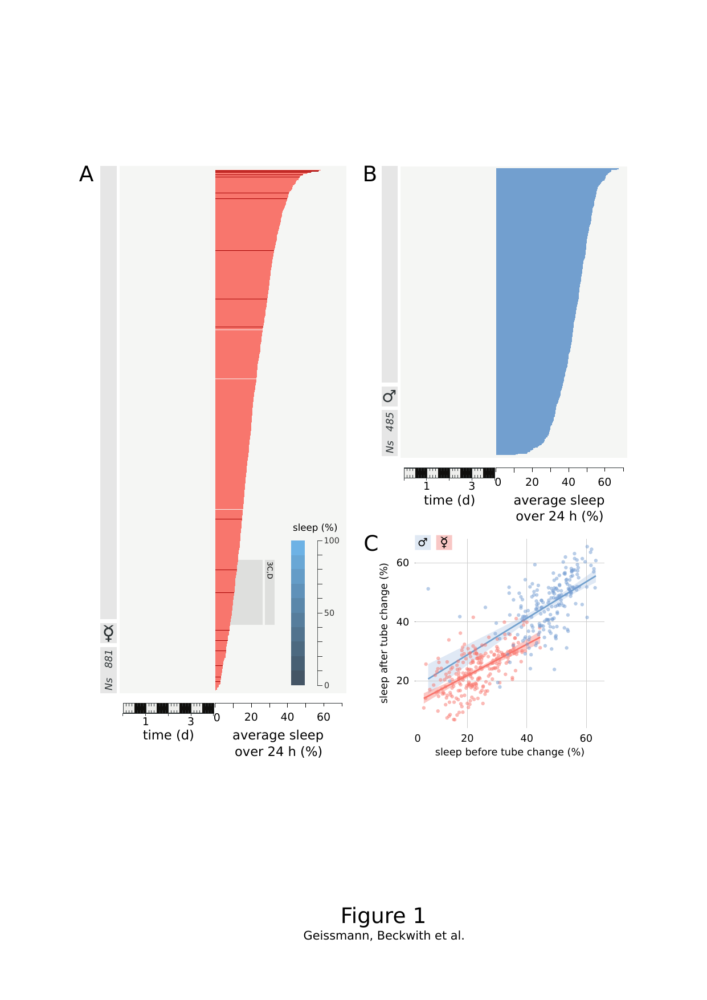
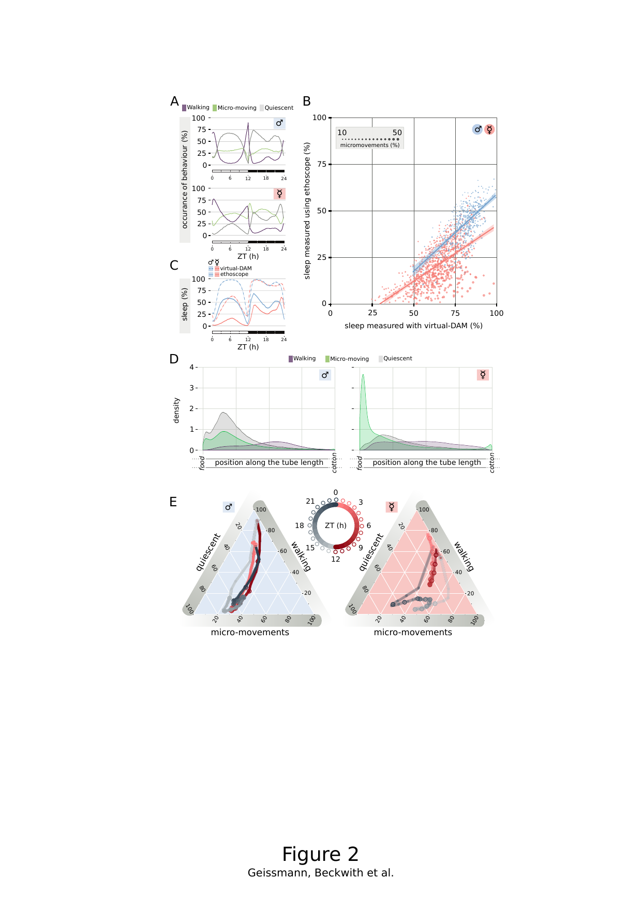
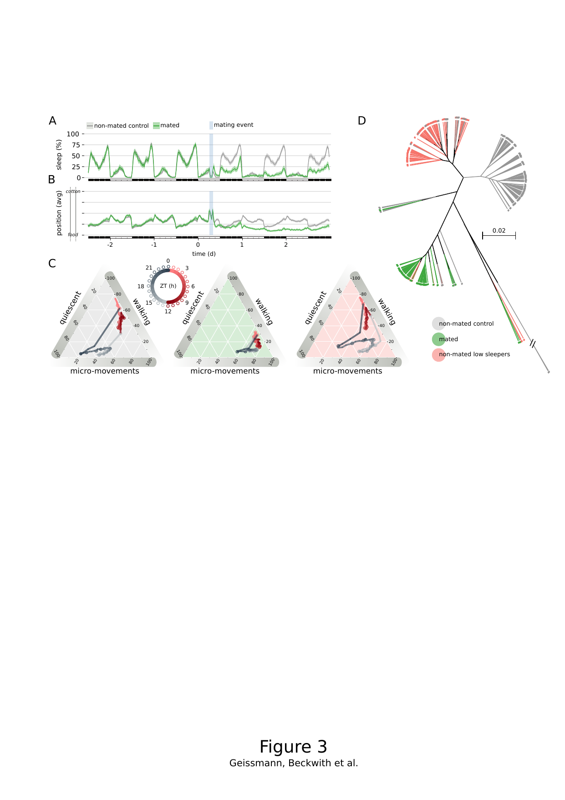
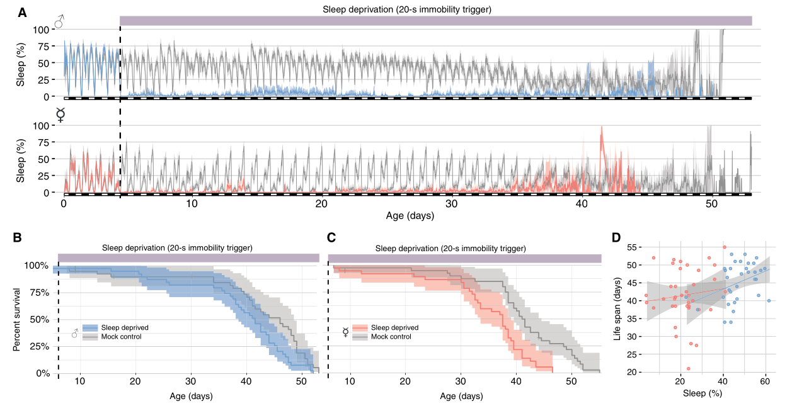
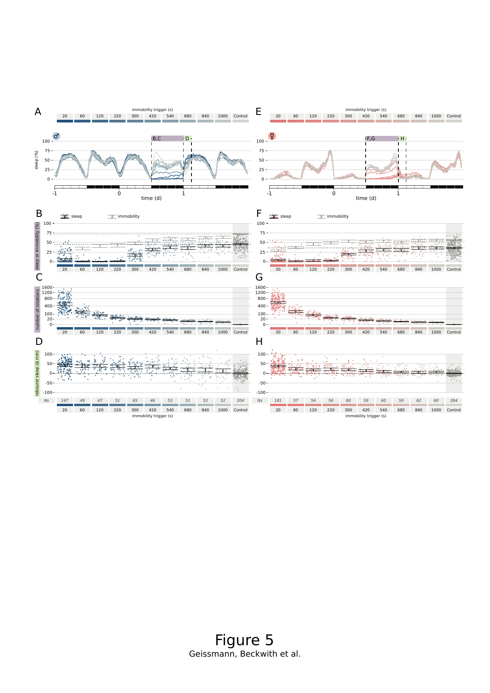
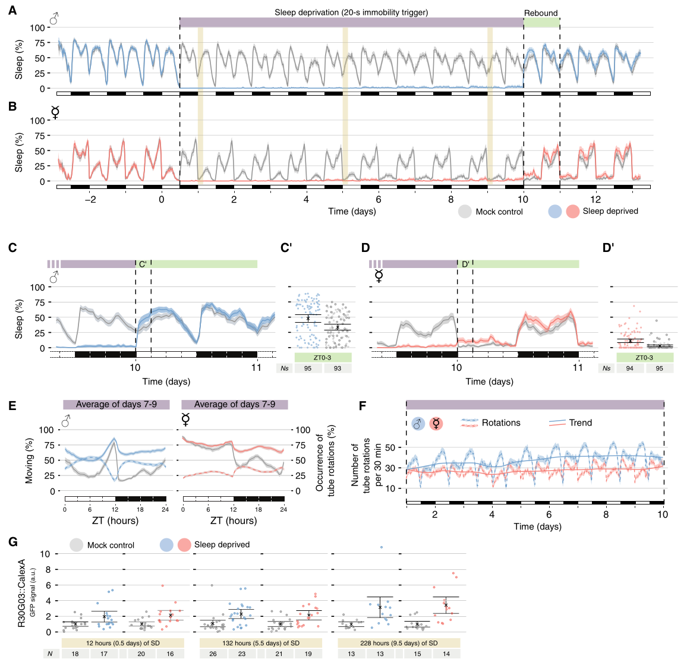

Code and metadata for [Quentin Geissmann\*, Esteban J. Beckwith\* and Giorgio F. Gilestro, 2019](https://advances.sciencemag.org/content/5/2/eaau9253)

# Figure reference for the published manuscript

## Fig. 1: Great variability in sleep amounts in a nonmutant population of D. melanogaster

* summary: Descending sorted distribution of sleep amount in females (A) and males (B). Panel C shows that sleep amount measured in a tube predicts sleep amount measured in a different tube.
* **Panels A-B**: experiment -- `20160404_overnight_dsd`, script -- `baseline.R`
* **Panel C**: experiment -- `20170109_tube_change_and_var`, script -- `script.R`
* Ns: N_F = 881, N_M = 485 (panels A-B); N_F = 242, N_M = 242 (panel C)
* figure material:
	1. `20160404_overnight_dsd/sorted_baseline_overview.pdf`, pages 1 & 2 -- distribution of individual **sleep** in **females**
	2. `20160404_overnight_dsd/sorted_baseline_overview.pdf`, pages 3 & 4 -- distribution of individual **sleep** in **males**
	3. `20170109_tube_change_and_var/tube_change_correlations.pdf`, page 1 -- **sleep** fraction after vs before tube change/shuffling

## Fig. 2: Micromovements account for the newly described short-sleeping phenotype

* summary: Average behavioral occurrence over 24h (A), ethoscope vs vDAM sleep comparison (B), sleep over 24h with both methods (C), positional distribution (D), and ternary plot representation (E).
* experiment -- `20160404_overnight_dsd`
* script -- `baseline.R`
* Ns: Same dataset as Fig. 1 (A and B)
* figure material:
	1. `overnight_dsd_baseline.pdf`, page 3 -- sleep fraction wrapped over 24h (panel C, continuous lines)
	2. `sleep_dam_overestimate.pdf`, page 1 -- relationship between DAM-scored and ethoscope-scored sleep (panel B). Dot size shows micromovement proportion
	3. `ternary_plots.pdf`, page 10 -- summary ternary plot (panel E)
	4. `ternary_plots.pdf`, page 11 -- positional distribution of behaviors by sex (panel D)

## Fig. 3: Mating reduces sleep amount

* summary: Sleep profile of mated vs non-mated females (A), average position (B), ternary representation (C), and hierarchical clustering (D).
* experiment -- `20170814_virgin_vs_mated`
* script -- `script.R`
* Ns: N_mated = 86, N_virgin = 152
* figure material:
	1. `virgin_vs_mated.pdf`, page 1 -- **sleep** fraction (panel A)
	2. `virgin_vs_mated.pdf`, page 3 -- **position** 0 <=> food, 1 <=> cotton wool (panel B)
	3. `virgin_vs_mated-ternary_plots.pdf`, page 2 -- ternary plot post-mating (panel C)

## Fig. 4: Chronic mechanical sleep deprivation is largely not lethal in D. melanogaster

* summary: Lifelong sleep restriction with 20s inactivity trigger (A), survival curves for males (B) and females (C), and sleep vs lifespan correlation (D).
* experiment -- `20180305_sd_until_death`
* script -- `rebound-final.R`
* Ns: n = 38-40 per group
* figure material:
	1. `life_long_sd.pdf` -- lifelong sleep restriction (panel A)
	2. `sd_until_death_surv.pdf` -- survival curves (panels B, C)
	3. `sleep_predicts_life.pdf` -- sleep amount vs lifespan correlation (panel D)

## Fig. 5: Sleep rebound is not linearly proportional to sleep loss

* summary: 12h overnight sleep deprivation with 10 different interval triggers (20-1000s). Sleep profiles (A, E), sleep/immobility quantification (B, F), stimuli counts (C, G), rebound quantification (D, H).
* experiment -- `20160404_overnight_dsd`
* script -- `rebound.R`
* Ns: N_M = 818, N_F = 912; N > 45 / treatment * sex
* figure material:
	1. `overnight_dsd_rebound.pdf`, page 1 -- **sleep** fraction **20s vs control**
	2. `overnight_dsd_rebound.pdf`, page 2 -- **sleep** fraction **20s vs control**, zoomed in
	3. `overnight_dsd_rebound.pdf`, page 3 -- **sleep** fraction **all intervals vs control**
	4. `overnight_dsd_rebound.pdf`, page 4 -- **quiescence** fraction **20s vs control**
	5. `overnight_dsd_rebound.pdf`, page 5 -- **quiescence** fraction **20s vs control**, zoomed in
	6. `overnight_dsd_rebound.pdf`, page 6 -- **quiescence** fraction **all intervals vs control**
	7. `overnight_dsd_rebound.pdf`, page 7 -- **absolute number of stimuli** **20s vs control**
	8. `overnight_dsd_rebound.pdf`, page 8 -- **absolute number of stimuli** **20s vs control**, zoomed in
	9. `overnight_dsd_rebound.pdf`, page 9 -- **absolute number of stimuli** **all intervals vs control**
	10. `overnight_dsd_rebound.pdf`, page 15 & 16 -- sleep amount in 3h or 6h following SD (ZT 0-3 or ZT 0-6). Bootstrap error bars

## Fig. 6: Sleep pressure is largely under the control of the circadian rhythm

* summary: 9.5-day (228h) sleep deprivation with 20s intervals. Sleep profiles (A, B), rebound magnification (C, D), rebound quantification (C', D'), activity (E), rotations over time (F), CaLexA quantification (G).
* experiment -- `20170209_prolonged_sd`
* script -- `rebound.R`
* Ns: n = 93-95 per group
* figure material:
	1. `prolonged_sd_rebound.pdf`, page 1 -- **sleep** fraction **20s vs control**
	2. `prolonged_sd_rebound.pdf`, page 2 -- **sleep** fraction **20s vs control**, zoomed in
	3. `prolonged_sd_rebound.pdf`, page 3 -- **quiescence** fraction **20s vs control**
	4. `prolonged_sd_rebound.pdf`, page 4 -- **quiescence** fraction **20s vs control**, zoomed in
	5. `prolonged_sd_rebound.pdf`, page 5 -- **absolute number of stimuli** **20s vs control**
	6. `prolonged_sd_rebound.pdf`, page 6 -- **absolute number of stimuli** **20s vs control**, zoomed in
	7. `prolonged_sd_rebound.pdf`, page 8 -- **relative number of stimuli** wrapped over circadian day
	8. `prolonged_sd_rebound.pdf`, page 9 & 10 -- sleep amount in 3h or 6h following SD. Bootstrap error bars
	9. `prolonged_sd_surv.pdf`, page 1 -- Survival curve

# Supplementary Figures

## Fig. S1: Representative tracings of behavioral activity

* summary: 48h behavioral activity as recorded by ethoscopes for all 881 female flies shown in Fig. 1A.
* experiment -- `20160404_overnight_dsd`
* script -- `baseline.R`
* figure material:
	1. `overnight_dsd_baseline.pdf`, page 5 -- individual fine-grain behaviour for 19 females over 48h, 1min resolution

## Fig. S2: Sorted hierarchical cluster analysis

* summary: Supplement to Fig. 3 - hierarchical clustering based on pairwise distance.
* experiment -- `20170814_virgin_vs_mated`
* script -- `script.R`

## Fig. S3: Decrease in locomotion activity in sleep-deprived flies

* summary: Possible sign of physical fatigue in SD flies over time.
* experiment -- `20180305_sd_until_death`
* script -- `rebound-final.R`

## Fig. S4: Circadian rhythm vs homeostatic drive

* summary: Circadian rhythm, not homeostatic drive, is the major contributor to sleep pressure during long-term SD.
* experiment -- `20170209_prolonged_sd`
* script -- `rebound.R`
* figure material:
	1. `prolonged_sd_rebound.pdf`, page 15 -- observed quiescence - predicted quiescence in 3h (min)
	2. `prolonged_sd_rebound.pdf`, page 16 -- Probability of positive rebound

# Additional unpublished analyses

The following experiments were conducted but not included in the final publication.

## DSD for 4 hours only (ZT 20-24)

* experiment -- `20160722_time_window_dsd`
* script -- `rebound.R`
* N > 50 / treatment * sex
* figure material:
	1. `time_window_dsd_rebound.pdf`, page 1 -- **sleep** fraction **20s vs control**
	2. `time_window_dsd_rebound.pdf`, page 2 -- **sleep** fraction **20s vs control**, zoomed in
	3. `time_window_dsd_rebound.pdf`, page 3 -- **quiescence** fraction **20s vs control**
	4. `time_window_dsd_rebound.pdf`, page 4 -- **quiescence** fraction **20s vs control**, zoomed in
	5. `time_window_dsd_rebound.pdf`, page 5 -- **absolute number of stimuli** **20s vs control**
	6. `time_window_dsd_rebound.pdf`, page 6 -- **absolute number of stimuli** **20s vs control**, zoomed in

## Systematic prolonged SD

* experiment -- `20170321_systematic_prolonged_sd`
* script -- `rebound.R`
* N > 70 / treatment * sex
* figure material:
	1. `prolonged_sd_rebound.pdf` -- various analyses

## Sleep deprivation, 12h in L phase (ZT 0-12)

* experiment -- `20171017_dsd_l_phase`
* script -- `rebound.R`
* N > 60 / treatment * sex
* figure material:
	1. `l_phase_dsd_rebound.pdf`, page 1 -- **sleep** fraction **20s vs control**
	2. `l_phase_dsd_rebound.pdf`, page 2 -- **sleep** fraction **20s vs control**, zoomed in
	3. `l_phase_dsd_rebound.pdf`, page 3 -- **quiescence** fraction **20s vs control**
	4. `l_phase_dsd_rebound.pdf`, page 4 -- **quiescence** fraction **20s vs control**, zoomed in
	5. `l_phase_dsd_rebound.pdf`, page 5 -- **absolute number of stimuli** **20s vs control**
	6. `l_phase_dsd_rebound.pdf`, page 6 -- **absolute number of stimuli** **20s vs control**, zoomed in

## Sleep deprivation, 8h in L phase (ZT 0-8)

* experiment -- `20171017_dsd_zt0_8`
* script -- `rebound.R`
* N > 60 / treatment * sex
* figure material:
	1. `dsd_zt0_8_rebound.pdf`, page 1 -- **sleep** fraction **20s vs control**
	2. `dsd_zt0_8_rebound.pdf`, page 2 -- **sleep** fraction **20s vs control**, zoomed in
	3. `dsd_zt0_8_rebound.pdf`, page 3 -- **quiescence** fraction **20s vs control**
	4. `dsd_zt0_8_rebound.pdf`, page 4 -- **quiescence** fraction **20s vs control**, zoomed in
	5. `dsd_zt0_8_rebound.pdf`, page 5 -- **absolute number of stimuli** **20s vs control**
	6. `dsd_zt0_8_rebound.pdf`, page 6 -- **absolute number of stimuli** **20s vs control**, zoomed in

## fumin prolonged SD

* experiment -- `20171016_fumin_prolonged_sd`
* script -- `rebound.R`

## Cross-experiment clustering

* experiment -- `20180131_cross_xp_cluster`
* script -- `cluster.R`

## Movement control

* experiment -- `20160722_movement_control`
* script -- `rebound.R`
